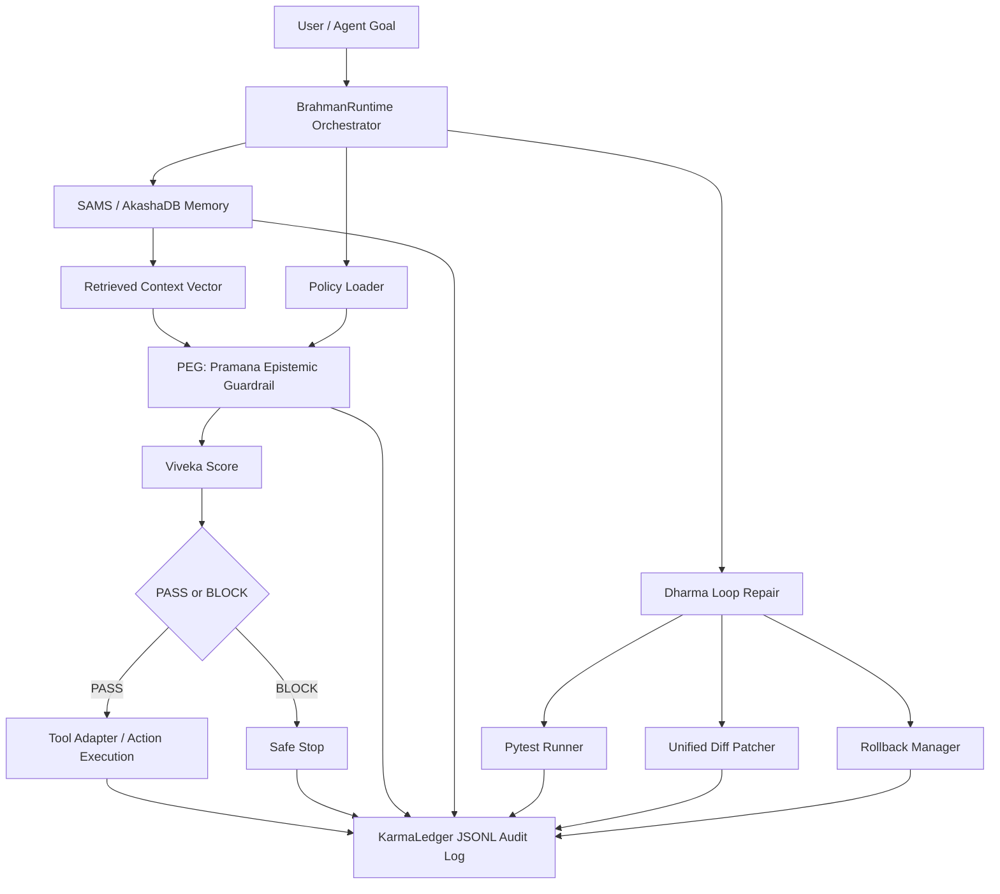

# Brahman-OS: Neurosymbolic Runtime for Safe Autonomous AI Agents

Brahman-OS is a production-grade prototype runtime for building autonomous AI
agents that can remember, verify, audit, repair, and roll back their own actions.
It combines a tensor memory substrate, symbolic policy checks, explainable safety
scoring, append-only audit logs, and an autonomous software repair loop.

The project is designed as a concrete answer to a practical question:

> How do we make agentic systems safer when they can retrieve context, call
> tools, modify files, and take actions that may be difficult to undo?

## Problem statement

Modern autonomous agents are increasingly capable, but their runtime stack is
often brittle. Most systems still rely on a plain LLM loop:

1. receive a task;
2. retrieve some context;
3. generate an action;
4. call a tool;
5. hope the result is correct.

That architecture is not enough for high-trust autonomy. A safer runtime needs
explicit memory semantics, verifiable policy checks, calibrated pass/block
decisions, action auditability, and recovery paths when a patch or tool call
goes wrong.

Brahman-OS explores that runtime layer.

## Why current agents fail

Current agents commonly fail in four predictable ways:

- Hallucination: the model produces plausible claims or patches that are not
  grounded in the available context.
- Memory drift: retrieved memories become stale, over-weighted, or detached
  from their provenance.
- Unsafe tool use: generated actions can call tools, modify files, or propose
  domain-sensitive decisions without adequate symbolic checks.
- Unrecoverable actions: once an agent mutates state, many systems lack a
  reliable audit trail, rollback snapshot, or repair verification loop.

Brahman-OS treats these as runtime failures, not just prompting failures.

## Architecture



## Core modules

### SAMS / AkashaDB

SAMS, the Semantic Associative Memory Substrate, contracts a sequence of hidden
states into a stable memory vector. AkashaDB is the in-memory tensor store that
updates an associative matrix using outer products and returns explainable
read results.

Key files:

- `src/brahman_os/memory/sams.py`
- `src/brahman_os/memory/akasha_store.py`

### PEG

PEG, the Pramana Epistemic Guardrail, combines vector grounding with symbolic
rule validation. It produces an explainable `VivekaDecision` containing scores,
evidence, violated rules, provenance, and the final pass/block decision.

Key files:

- `src/brahman_os/guardrails/peg.py`
- `src/brahman_os/guardrails/policy_loader.py`
- `src/brahman_os/guardrails/viveka.py`

### Viveka Score

The Viveka Score is the runtime's composite safety score. It fuses:

- pratyaksha: direct vector similarity to context;
- anumana: symbolic rule validation;
- a thresholded final decision.

### KarmaLedger

KarmaLedger is an append-only JSONL audit log. Every action, guardrail decision,
repair attempt, rollback snapshot, and test run can be recorded as structured
evidence.

Key file:

- `src/brahman_os/ledger/karma_ledger.py`

### Dharma Loop Repair

The Dharma Loop is the autonomous software repair subsystem. It runs tests,
generates patches, validates diffs, snapshots files, applies patches, runs
static checks, and rolls back failed attempts.

Key files:

- `src/brahman_os/repair/test_runner.py`
- `src/brahman_os/repair/patcher.py`
- `src/brahman_os/repair/rollback.py`
- `src/brahman_os/repair/llm_patch_generator.py`

## Mathematical model

### Sphota sequence contraction

Given hidden states:

```text
H in R^(B x N x D)
```

SAMS computes a sigmoid gate:

```text
gamma = sigmoid(W_g H)
```

and a gated sequence projection:

```text
psi = LayerNorm(sum_i(W_s H_i * gamma_i))
```

where:

- `B` is batch size;
- `N` is sequence length;
- `D` is embedding dimension;
- `gamma` controls which sequence components contribute to the contracted memory;
- `psi` is the Sphota-style compressed semantic vector.

### Krama weights

Krama encodes relative temporal distance between sequence positions:

```text
K[i, j] = exp(-abs(i - j) / max(tau, 1.0))
```

Nearby tokens receive stronger contextual influence than distant tokens. SAMS
uses this matrix to reconstruct contextual hidden states:

```text
H_context = K @ H
H_hat = W_dec(concat(psi_expanded, H_context))
```

The reconstruction objective is mean squared error:

```text
L_recon = MSE(H_hat, H)
```

### Outer-product memory update

AkashaDB stores memory in a tensor matrix:

```text
M_t in R^(D x D)
```

For a memory vector `psi`, the update is:

```text
M_t = lambda * M_t + outer(psi, psi)
```

where `lambda` is the decay factor. Reads project a query through the memory matrix:

```text
Q' = q M_t
```

This gives a simple associative memory mechanism with decay, snapshots,
rollback, and explainable read metadata.

### Viveka score

PEG first computes normalized cosine similarity:

```text
pratyaksha = (cos(generated, context) + 1) / 2
```

Symbolic validation gives:

```text
anumana =
  1.0  if all matched critical rules pass
  0.0  if a critical contradiction is found
  0.5  if no rule matches
```

The final Viveka score is:

```text
if anumana == 0.0:
    viveka = pratyaksha * 0.2
elif anumana == 1.0:
    viveka = max(pratyaksha, 0.72)
else:
    viveka = pratyaksha
```

The decision rule is:

```text
PASS  if viveka >= threshold
BLOCK otherwise
```

## Setup

### Create a virtual environment

```console
python -m venv .venv
.\.venv\Scripts\python.exe -m pip install --upgrade pip
```

### Install dependencies

```console
.\.venv\Scripts\python.exe -m pip install -r requirements.txt
```

For editable local development:

```console
.\.venv\Scripts\python.exe -m pip install -e ".[dev]"
```

### Run checks locally

On Windows, use the repo test wrapper so pytest gets a unique temp directory:

```console
powershell -ExecutionPolicy Bypass -File .\scripts\test.ps1
.\.venv\Scripts\ruff.exe check .
.\.venv\Scripts\mypy.exe src
.\.venv\Scripts\bandit.exe -r src
```

## Demo commands

### Medical policy guardrail demo

```console
.\.venv\Scripts\python.exe examples\medical_policy_guardrail\run.py
```

This demo evaluates safe and unsafe clinical claims against
`policies/medical_safety.yaml`, runs PEG, logs decisions to KarmaLedger, and
prints explainable JSON.

### Software repair demo with mock provider

```console
.\.venv\Scripts\python.exe examples\software_repair\run.py --provider mock
```

This runs a controlled buggy `BoundedMemoryStack`, captures a failing test,
generates a mock patch, applies it, runs static checks, reruns tests, performs
PEG approval, logs all steps, and prints one JSON summary.

### Software repair demo with Gemini provider

Gemini is live and opt-in only:

```console
$env:RUN_LIVE_API_TESTS = "1"
$env:GEMINI_API_KEY = "<your-gemini-api-key>"
$env:GEMINI_MODEL = "gemini-3.5-flash"
.\.venv\Scripts\python.exe examples\software_repair\run.py --provider gemini
```

Normal tests and CI do not require API keys.

### Dashboard

```console
streamlit run dashboard/app.py
```

The dashboard reads local KarmaLedger JSONL files and renders overview metrics,
ledger tables, Viveka timelines, memory state, and repair runs.

### Benchmarks

```console
.\.venv\Scripts\python.exe benchmarks\benchmark_guardrails.py
.\.venv\Scripts\python.exe benchmarks\benchmark_repair.py --provider mock --max-cases 3
```

Benchmark outputs are written to:

- `benchmarks/results/guardrail_results.json`
- `benchmarks/results/guardrail_results.csv`
- `benchmarks/results/repair_results.json`
- `benchmarks/results/repair_results.csv`

## Benchmark results

### Guardrail benchmark

The guardrail benchmark uses 80 deterministic synthetic clinical-safety claims:
20 safe claims, 20 unsafe dosage claims, 20 contradiction claims, and 20
irrelevant claims.

| Mode | Block rate | False positive rate | False negative rate | Avg. Viveka score | Latency ms |
|---|---:|---:|---:|---:|---:|
| LLM-only mock baseline | 0.000 | 0.000 | 1.000 | 0.800 | 0.000 |
| Vector similarity only | 0.275 | 0.000 | 0.633 | 0.810 | 0.324 |
| Symbolic rules only | 0.750 | 0.000 | 0.000 | 0.375 | 0.007 |
| SAMS + PEG Brahman-OS | 0.750 | 0.000 | 0.000 | 0.450 | 0.917 |

Interpretation: the synthetic benchmark is designed to show failure modes, not
claim clinical validity. The mock LLM baseline over-trusts clinical-looking
claims. Vector-only grounding catches some irrelevant claims but misses many
symbolic safety violations. Symbolic rules and SAMS + PEG block all unsafe
claims in this controlled dataset.

### Repair benchmark sample

The repair benchmark contains 10 controlled Python bug cases. The checked-in
sample result below was generated with:

```console
.\.venv\Scripts\python.exe benchmarks\benchmark_repair.py --provider mock --max-cases 3
```

| Case | Provider | Patch generated | Valid diff | PEG passed | Static checks | Tests passed | Rollback |
|---|---|---:|---:|---:|---:|---:|---:|
| bounded_stack_capacity_bug | mock | true | true | true | true | true | false |
| incorrect_aggregation_logic | mock | true | true | true | true | true | false |
| missing_input_validation | mock | true | true | true | true | true | false |

## Safety limitations

Brahman-OS is a prototype research/runtime project. It improves observability
and control, but it is not a proof of safety.

Important limitations:

- Synthetic benchmarks are not substitutes for domain validation.
- Medical examples are toy policy demonstrations, not clinical guidance.
- Gemini patch generation is live only when explicitly enabled and should be
  reviewed before use on real repositories.
- Symbolic rules are only as good as the policy documents and validators.
- Tensor memory currently uses an in-memory store, not a hardened distributed
  database.
- PEG thresholds are configurable and must be calibrated per domain.
- Rollback is file-oriented; external side effects still need tool-specific
  compensating actions.

## Future roadmap

- Persistent AkashaDB backend with durable tensor snapshots.
- Richer policy DSL for domain-specific symbolic constraints.
- Multi-step tool adapters with explicit preconditions and postconditions.
- Stronger benchmark suites for web actions, file edits, and long-horizon tasks.
- Human review workflow for blocked, uncertain, or high-impact actions.
- Signed KarmaLedger records for tamper-evident audit trails.
- Dashboard filters for goals, action IDs, policies, and repair attempts.
- Expanded live-provider repair benchmarks with Gemini and other models.

## Resume bullets

- Designed and implemented Brahman-OS, a neurosymbolic runtime prototype for
  safe autonomous agents with tensor memory, symbolic guardrails, audit logging,
  and autonomous repair.
- Built SAMS/AkashaDB memory using gated sequence contraction, Krama relative
  weights, outer-product associative updates, snapshots, rollback, and
  explainable reads.
- Implemented PEG and Viveka scoring to combine vector grounding with symbolic
  rule validation into auditable PASS/BLOCK decisions.
- Created KarmaLedger, an append-only JSONL audit system for actions, repair
  attempts, test runs, rollback snapshots, and guardrail decisions.
- Built a Dharma Loop software repair pipeline with pytest-json-report,
  unified-diff validation, rollback snapshots, Ruff/mypy/Bandit verification,
  mock patch generation, and opt-in Gemini patch generation.
- Added Streamlit observability dashboard and deterministic benchmark suites for
  guardrail behavior and repair reliability.
